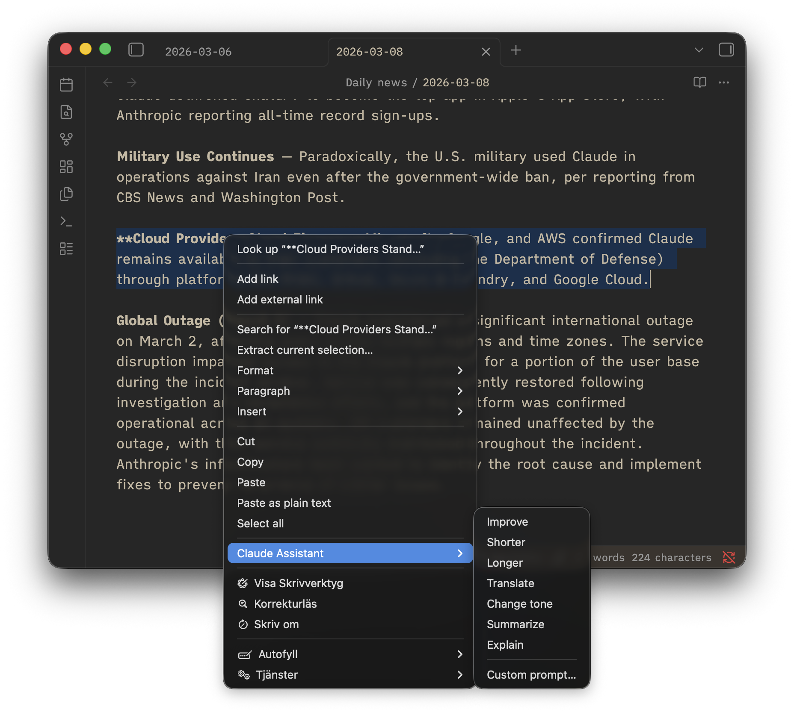

# Claude Assistant — Obsidian Plugin



AI-powered writing assistant for Obsidian using Anthropic's Claude.

## Features

Select text in any note, right-click, and choose an AI action from the context menu:

- **Improve** — Fix grammar, clarity, and flow
- **Make shorter** — Condense text
- **Make longer** — Expand with more detail
- **Translate** — Translate to a configured language
- **Change tone** — Rewrite in a different tone
- **Summarize** — Add a summary below the selection
- **Explain** — Add a simpler explanation below
- **Custom prompt** — Opens a dialog where you can type any instruction

## Installation

1. Clone or download this repository into your vault's `.obsidian/plugins/` folder
2. Run `npm install && npm run build`
3. Enable "Claude Assistant" in Obsidian Settings > Community plugins
4. Add your Anthropic API key in Settings > Claude Assistant

## Settings

| Setting | Description |
|---------|-------------|
| API Key | Your Anthropic API key |
| Model | Claude model (Sonnet, Opus, or Haiku) |
| Translation language | Target language for Translate |
| Default tone | Tone for Change tone action |

## Development

```bash
npm install
npm run dev    # Watch mode
npm run build  # Production build
```

## License

MIT
